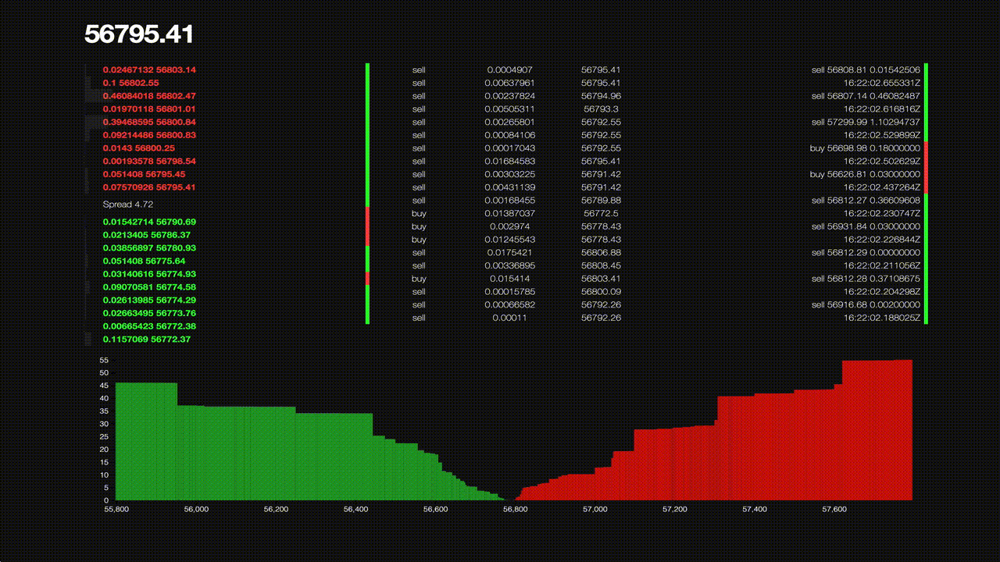
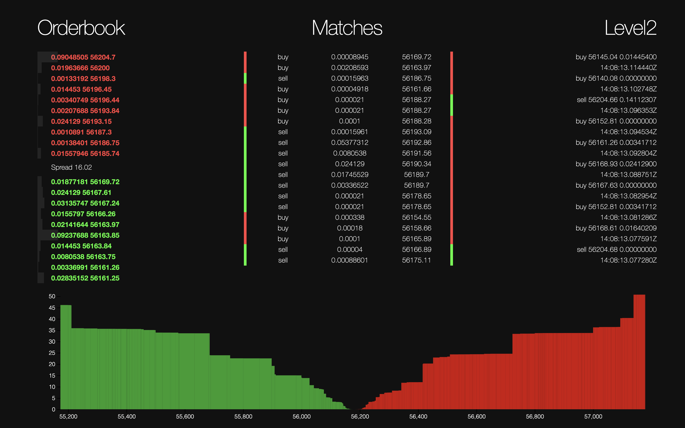

# CryptoWatch

> Like [pro.coinbase.com](https://pro.coinbase.com), but BEAM-flavoured



# Installation and usage
```
mix deps.get
iex -S mix phx.server
# or
mix phx.server
```

visit [`localhost:4000`](http://localhost:4000)

<!--  -->

# How it works

The `applications` running behind the scenes are:

```
# pub-sub channel for broadcasting updating to all websocket clients
{Phoenix.PubSub, [name: CryptoWatch.PubSub, adapter: Phoenix.PubSub.PG2]},

# websocket client configured for the currency pair BTC-EUR
{CryptoWatch.CoinbasePro.WebsocketClient, ["BTC-EUR"]},

# orderbook genserver that maintains the order book updated
CryptoWatch.OrderBook,

# cache for orderbook and past matches
CryptoWatch.Cache,

# HTTP endpoint
CryptoWatchWeb.Endpoint
```

I am also using Phoenix Channels and Sockets for realtime updates to the client.

`websockex` for handling the messages coming from the `wss://ws-feed.exchange.coinbase.com` websocket feed.

The websocket client connects to two channels, one for getting updates to matches.

And one channel connection to get Level2 updates to the order book.

I added a `CryptoWatch.CoinbasePro.ApiClient` to contact the `api.pro.coinbase.com` endpoint to get the latest snapshot of the order book.

The updates are broadcasted to all clients via the websocket connection.

The client can choose a currency pair, a filter is set for all incoming updates and only matching ones are updated on the UI.