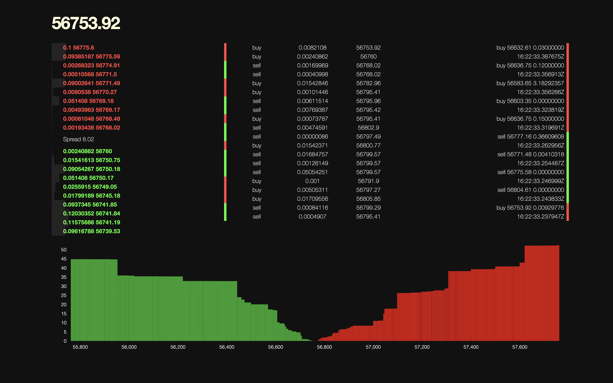

# CryptoWatch

> Like [pro.coinbase.com](https://pro.coinbase.com), but BEAM-flavoured

```
mix deps.get
iex -S mix phx.server
# or
mix phx.server
```

visit [`localhost:4000`](http://localhost:4000)

# Preview

